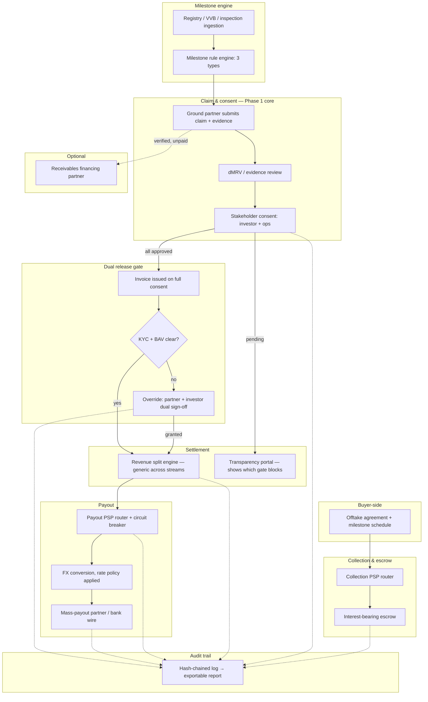
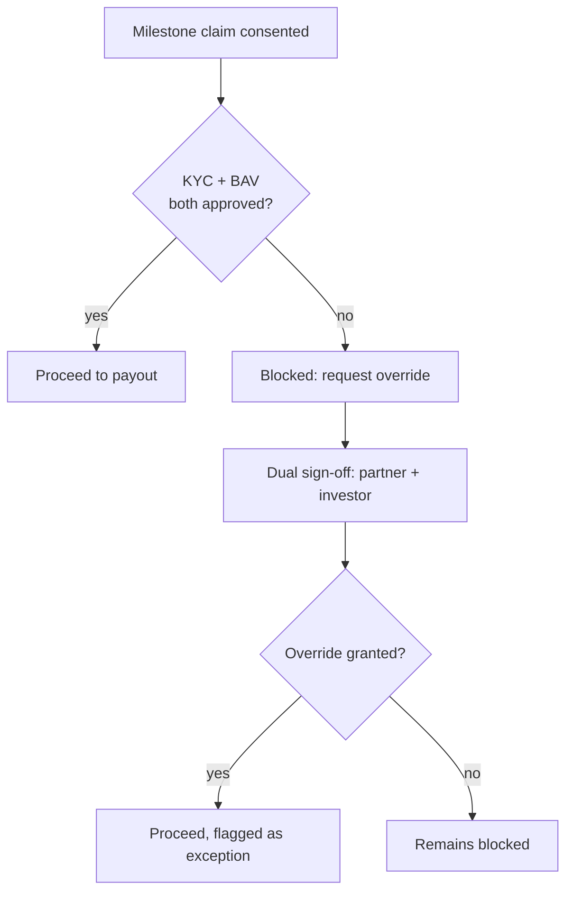
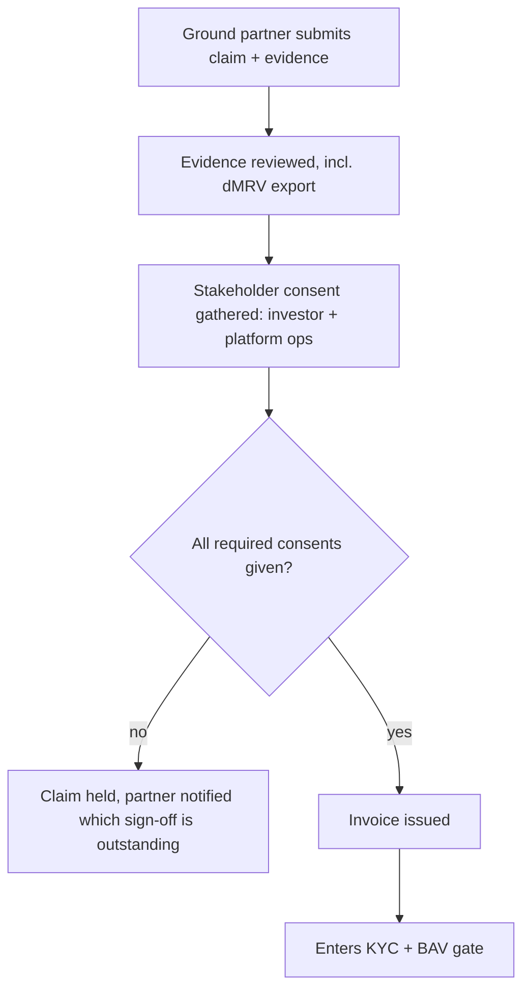
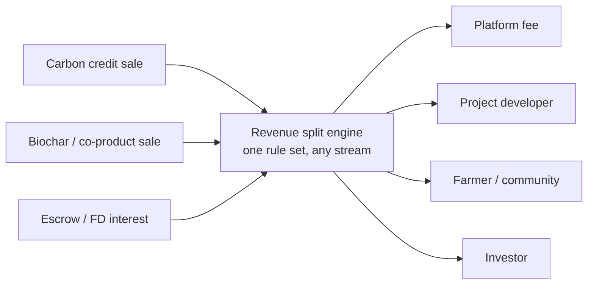
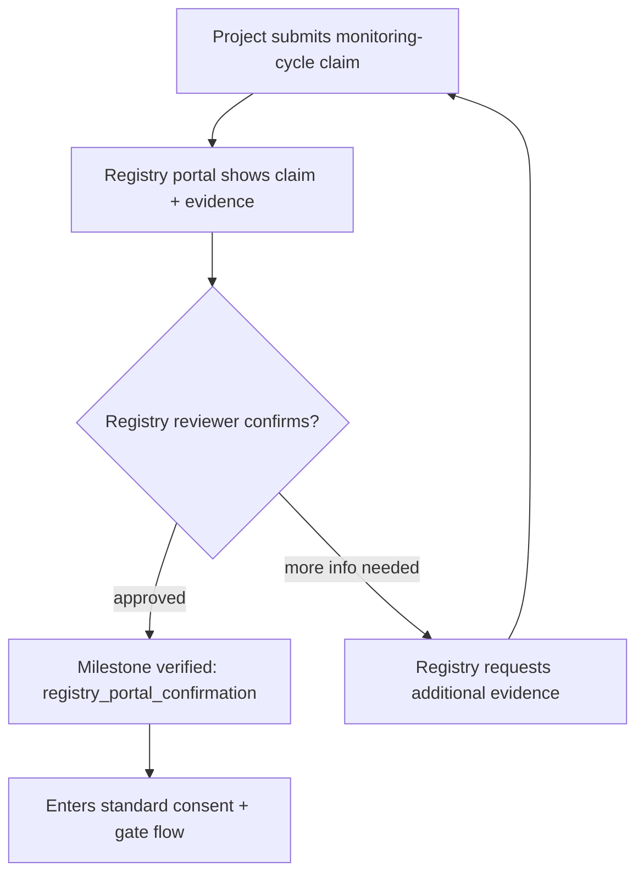
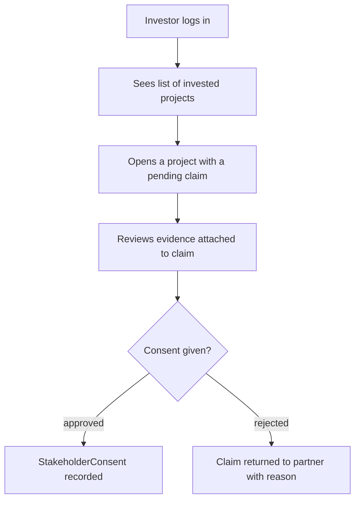
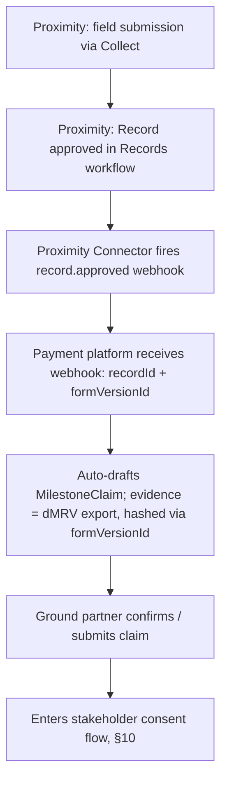

# Payment & Settlement Infrastructure for Carbon Markets — Comprehensive System Design (v3)

**Working name:** "the Platform" (placeholder — rename freely)
**Status:** v3 — consolidated and substantially extended. Earlier drafts (v1, v2) accumulated corrections and additions in the order they came up in conversation; this version reorganizes everything into one coherent reference and adds several sections that didn't exist yet: a glossary, a competitive-landscape recap, a full API sketch, multi-jurisdiction regulatory detail, a security/compliance section, a second worked example, and a metrics section. Nothing structural from v1/v2 was walked back except where explicitly noted as a correction.

---

# Part I — Foundations

## 1. Product vision

A payments and settlement layer purpose-built for the buyer → registry → project developer → farmer/landowner money chain in carbon markets — handling contract billing, evidence-based claims, multi-stakeholder consent, escrow (with interest), milestone- and registry-verification-triggered release, KYC/BAV-gated payout, multi-party revenue splits, FX, and a full audit trail.

For a reader new to this space, that sentence uses a lot of load-bearing terms — §3 defines every one of them before they're used again.

## 2. Why carbon markets, precisely scoped

This project is deliberately **not** two things that were seriously considered and ruled out by research earlier in this project:

- **Not an attempt to become a licensed PSP.** Becoming a licensed payment service provider (acquiring bank relationships, money-transmitter/PI licenses across jurisdictions) only pays for itself at roughly $300M+ in annual processed volume on a single platform. The entire global voluntary carbon market is roughly $2B/year, fragmented across thousands of small projects — nowhere near that threshold, and it never funnels through one platform anyway. Building on top of already-licensed rails (§23) is the only viable path at this market's actual size.
- **Not a tokenized-carbon-credit play.** Toucan Protocol and KlimaDAO already ran this exact experiment — bridging retired Verra credits into tradeable tokens (BCT) and building a treasury (KLIMA) around them. It collapsed: Verra banned tokenizing retired credits in 2022 specifically because retirement is supposed to mean "consumed," not reborn as a tradeable asset; traders dumped 600,000+ low-quality HFC-23 credits into the pool; KLIMA lost over 99% of its value. The market's real problem was credit **integrity and governance**, not payment technology — a lesson this design applies directly by never tokenizing the underlying asset (§18's data model has no `CarbonCreditToken` type, on purpose, permanently).

What **is** real and underserved, per the same research: milestone-gated disbursement (payment stuck for months awaiting registry verification, with no system connecting the two), last-mile farmer/developer payouts skimmed by intermediaries, and cross-border FX/compliance complexity. Nobody currently owns this layer — Patch, Cloverly, and Sylvera solve discovery/ratings, not money movement; even Salesforce's Net Zero Marketplace, the most credible big-tech carbon marketplace, just plugged in Stripe rather than building this. See §4 for the fuller competitive picture.

## 3. Glossary

A working reference — this document uses all of these terms precisely, and getting them right is most of what "being an expert in this field" actually means.

| Term | Meaning |
|---|---|
| **PSP** (Payment Service Provider) | A company that processes payments on behalf of a merchant (e.g. Stripe, Adyen). This platform is a customer of PSPs, not one itself. |
| **PayFac** (Payment Facilitator) | A platform that onboards its own sub-merchants under one master merchant account with an underlying licensed PSP, without becoming a licensed processor itself. This is the model this platform uses. |
| **Acquirer / Issuer** | The acquirer represents the merchant/payee side of a card transaction; the issuer represents the cardholder's own bank. Relevant mainly on the buyer-collection leg if buyers pay by card. |
| **KYC** (Know Your Customer) | Identity verification of a person or entity. Done once per recipient entity, not per payment (§13). |
| **BAV** (Bank Account Validation) | Verification that a specific bank account actually belongs to the entity claiming it — the formal name for the "penny-drop" check. Independent of KYC (§13). |
| **VVB** (Validation/Verification Body) | An independent auditor accredited by a carbon registry to confirm a project's claims before credits are issued. |
| **dMRV** (digital Measurement, Reporting, and Verification) | Field data, sensor/satellite confirmation, and monitoring records that evidence a carbon project's real-world activity. The direct evidence source for claims in this system (§9). |
| **Offtake agreement** | A forward purchase contract for carbon credits, typically structured with payment tranches tied to project milestones rather than one lump sum. |
| **Escrow** | Funds held by a neutral third party until agreed conditions are met — here, held pending milestone verification and consent, earning interest while held (§11). |
| **Registry** | The body that issues and tracks carbon credits (Verra, Gold Standard, Puro.earth, American Carbon Registry). Credits are only real once a registry issues them. |
| **Retirement** | The act of permanently taking a carbon credit out of circulation so it can be claimed against an emissions target — this is what Toucan violated by tokenizing already-retired credits. |
| **Core-portion interest** | RBI's rule (for payment-aggregator escrow accounts) that interest may only be earned on the stable, rolling-minimum balance, not on fast-moving float — the accrual model this design borrows in §11. |
| **T+N settlement** | Funds settle N days after a transaction. Relevant to why standard PayFac relationships (T+1 to T+14) don't fit this platform's multi-month escrow need (§23). |
| **Idempotency key** | A unique identifier attached to a request so that retrying it doesn't duplicate the effect (a double charge, a double payout). Non-negotiable in this design (§17). |
| **Circuit breaker** | A pattern where a system stops routing to a failing provider and automatically fails over to the next-best option, rather than repeatedly hitting a broken dependency. |
| **Hash-chaining** | Each audit log entry stores a hash of itself plus the previous entry's hash, making the sequence tamper-evident without needing a public blockchain. |

## 4. Competitive landscape — what exists, and the actual gap

| Player | What they actually do | Relevance here |
|---|---|---|
| **Patch, Cloverly, Sylvera** | Credit discovery, sourcing, and quality ratings for buyers | Solve *finding and trusting* a credit, not moving money through its lifecycle |
| **Salesforce Net Zero Marketplace** | Carbon credit marketplace on Commerce Cloud | Payments are handled by Stripe underneath — a telling signal that even a well-resourced incumbent didn't attempt to solve this layer itself |
| **Carbonplace** | A bank-consortium-backed network for settling carbon credit *transactions* between institutions | Closest real analog, but it's a trading-settlement network among banks/brokers — it doesn't do milestone-based escrow, evidence-based claims, or last-mile farmer disbursement |
| **Toucan Protocol / KlimaDAO** | Tokenized carbon credits on-chain | A cautionary tale, not a template (see §2) |
| **"CarbonPay"** | A generic-sounding fintech name that surfaced in research | Confirmed to be an unrelated fleet/expense product, not a carbon-market payment company — evidence that no credible incumbent currently owns this specific category |

The gap this design targets — milestone-gated escrow with evidence-based claims, multi-stakeholder consent, and transparent last-mile disbursement — is real and, as far as this project's research could find, unaddressed by any existing player.

## 5. The innovative fintech route — six mechanisms, each answering a documented pain point

1. **Configurable, typed milestones**, not one generic "verification" trigger (§7).
2. **Claim-based, evidence-attached invoicing** initiated by the party doing the work, not auto-billed by the platform (§8, §9) — the correction that most changed this design from its first draft.
3. **Multi-stakeholder consent** as the normal path every claim goes through (§10).
4. **Escrow that earns interest, with a stated allocation policy** rather than treating held funds as dead capital (§11) — folded into the same generic split logic as every other revenue stream (§12).
5. **Payment release gated on two independent, entity-level conditions** (KYC and BAV), never re-verified needlessly, only re-triggered by named events (§13), with a dual-authorization override for genuine exceptions (§14).
6. **A hash-chained audit trail for the *process*, never the *asset*** — deliberately the inverse of Toucan's mistake (§18).

---

# Part II — The money lifecycle

## 6. End-to-end lifecycle overview

```
Buyer signs offtake agreement → defines milestone schedule + revenue-split rule set + PSP routing preferences
        │
        ▼
Buyer pays initial tranche → collection PSP router picks best route → funds land in interest-bearing escrow
        │                                                                        │
        │                                              (interest accrues on the core portion, per §11, for as long as funds sit here)
        ▼
Ground partner submits a MilestoneClaim with evidence (often a dMRV export, §9)
        │
        ▼
Required stakeholders (investor, platform ops, sometimes buyer) each record consent (§10)
        │
        ├── any required consent still pending → claim held, transparency portal shows exactly which sign-off is outstanding
        │
        └── all consents approved → invoice issued
                │
                ▼
        Recipient's KYC + BAV status checked (a status read, not a re-verification, §13)
                │
                ├── not clear → blocked_awaiting_kyc / blocked_awaiting_bav → override path available (§14), otherwise stays in escrow (still earning interest)
                │
                └── clear → payable
                        │
                        ▼
                Revenue split engine calculates each party's share (§12) — same logic for credit-sale proceeds, biochar/co-product sale revenue, and escrow interest
                        │
                        ▼
                Payout PSP router selects best rail per corridor, with circuit-breaker fallback (§15)
                        │
                        ▼
                FX conversion applied per the agreement's rate-timing policy (§16)
                        │
                        ▼
                Payout executes — marked "paid" only once settlement is actually confirmed, not merely initiated (§17)
                        │
                        ▼
                Hash-chained audit trail entry appended at every step above (§18)
```

## 7. Milestone taxonomy (buyer-configurable per agreement)

An offtake agreement is a list of typed `MilestoneTerm`s. A buyer isn't limited to "release on registry verification" — that's only one of three real milestone shapes seen in actual project lifecycles, and a single agreement normally chains all three:

| Type | Example | Typical evidence | Typical verifier |
|---|---|---|---|
| **Setup / CAPEX** | "Pyrolysis plant commissioned" | Site inspection photos, GIS/satellite confirmation | Third-party inspector, or the platform's own satellite/GIS check |
| **Achievement / performance** | "First 1,000 tonnes of biochar produced and field-applied" | Production logs, application records, field data | Ops/science review |
| **Monitoring-cycle / registry** | "First monitoring period complete, credits issued" | Registry API status change, or VVB attestation upload | The registry itself (Verra, Gold Standard, Puro.earth) or its VVB |

```ts
type MilestoneType = "setup_capex" | "achievement" | "monitoring_cycle";

interface MilestoneTerm {
  id: string;
  type: MilestoneType;
  label: string;
  percentOfTotal: number;
  verificationSource: "site_inspection" | "gis_satellite" | "ops_data_review" | "registry_api" | "vvb_attestation_upload";
  registryRef?: string; // only for monitoring_cycle type
  order: number;
}
```

## 8. Claim-based invoicing — the Phase 1 model, corrected

An earlier draft of this design assumed the platform auto-generates invoices on a fixed schedule. That's wrong for how this actually needs to work: **the ground partner initiates each invoice as a claim, with evidence attached, and it becomes payable only after the required stakeholders consent.** This is structurally the same pattern as a construction-loan draw request — the party doing the work reports progress and requests funds; the financing side doesn't unilaterally decide when to pay. It's a well-precedented financial workflow, just one nobody has productized for carbon markets specifically.

```ts
interface MilestoneClaim {
  id: string;
  milestoneId: string;
  submittedBy: string; // ground partner / project developer
  submittedAt: string;
  claimedAmount: number;
  evidenceAttachments: EvidenceAttachment[];
  status: "submitted" | "under_review" | "consented" | "rejected" | "paid";
}

interface Invoice {
  id: string;
  agreementId: string;
  milestoneId: string;
  claimId: string; // Phase 1: every invoice traces back to a consented claim
  amount: number;
  currency: string;
  status: "draft" | "issued" | "paid" | "overdue";
  triggerReason: "claim_consented"; // later phases may add "registry_api_verified" as automation matures
}
```

Later phases (once registry APIs are more available, §29) can layer in more automatic triggering — but Phase 1 should not pretend to automate what actually requires a human claim and human consent. Building the honest, manual version first is also how the platform learns what should eventually be automated, rather than guessing.

## 9. Evidence, and the direct link to dMRV

Every `EvidenceAttachment` on a claim has a source type, and the most important one is a project's own dMRV output — the same category of field data, GIS confirmation, and monitoring records that a standalone dMRV tool (an earlier, separate design exercise in this same project) is built around. That earlier work isn't unrelated — its natural role is exactly here: **a project's dMRV system is the evidence generator, and this payments platform is where that evidence gets consumed to actually move money.** A partner running their own dMRV tooling exports a verifiable record and attaches it directly to a claim.

```ts
interface EvidenceAttachment {
  id: string;
  claimId: string;
  sourceType: "dmrv_export" | "site_inspection_photo" | "production_log" | "registry_document" | "other";
  fileRef: string;
  hash: string; // tamper-evidence, consistent with the audit trail's hash-chaining
  submittedAt: string;
}
```

## 10. Multi-stakeholder consent — a first-class step, not a rubber stamp

A claim doesn't become payable just because evidence was attached — it needs explicit, recorded consent from whichever stakeholder roles the agreement requires (typically the investor and platform ops; the buyer may also be a required consenter). This is distinct from, and sits *before*, the override mechanism in §14 — consent is the normal path every claim goes through; override exists only to bypass the KYC/BAV gate specifically, after consent, as an exception.

```ts
interface StakeholderConsent {
  id: string;
  claimId: string;
  requiredRole: "investor" | "buyer" | "platform_ops";
  consentedBy?: string;
  consentedAt?: string;
  status: "pending" | "approved" | "rejected";
  evidenceReviewed: string[]; // which EvidenceAttachment ids this consent was actually based on
}
```

A claim only becomes an issued `Invoice` once every required `StakeholderConsent` is `approved`.

## 11. Escrow interest mechanics

Held funds sit in an interest-bearing escrow/trust account, not a zero-yield holding pen. Two separate decisions:

**Accrual.** A precedented pattern worth borrowing even outside India: RBI's rule for payment-aggregator escrow accounts allows interest only on the *core portion* of the balance — the average of the lowest daily balances over the preceding 26 fortnights — specifically to prevent a platform from claiming yield on money that's actually just fast-moving float.

**Allocation.** Who benefits from that interest is a real business-model decision, not a default to bury: credited back to the buyer, added to the distributable pool (developer/farmer benefit), or retained as platform revenue (a legitimate, common float-income model). As §12 makes explicit, this doesn't need its own bespoke field — interest is simply another revenue stream routed through the same split engine as everything else. Default recommendation: split it into the distributable pool, since keeping it as pure platform margin would cut against this product's own fairness positioning.

```ts
interface EscrowAccount {
  id: string;
  agreementId: string;
  heldAmount: number;
  currency: string;
  corePortionBalance: number;
  interestAccruedToDate: number;
  status: "holding" | "partially_released" | "fully_released";
}
```

## 12. One generic revenue-split engine, not one per revenue type

Carbon credit sale proceeds, direct biochar (or other co-product) sales, and escrow interest income are all just different *inputs* to the same distribution logic — never three separate, hand-coded splitting mechanisms.

```ts
interface RevenueStream {
  id: string;
  projectId: string;
  streamType: "carbon_credit_sale" | "biochar_product_sale" | "escrow_interest" | "other_project_revenue";
  amount: number;
  currency: string;
  splitRuleSetId: string;
}

interface SplitRuleSet {
  id: string;
  label: string;
  rules: { participantRole: "platform" | "developer" | "farmer_community" | "investor"; percent: number }[];
}
```

## 13. The dual gate: KYC and BAV, verified once per entity

KYC (identity) and BAV (bank account ownership) are **two separate flags per recipient, not one combined status** — a recipient can be KYC-approved but BAV-pending, or vice versa.

**Verification is a one-time, entity-level process, not something that re-runs per payment.** Once approved, every subsequent payout for that same entity just *reads* the existing status — a cheap lookup, not a new verification call. Re-verification is only triggered by specific, named events:

```ts
interface PayoutRecipient {
  id: string;
  role: "developer" | "farmer_community";
  kycStatus: "not_started" | "in_review" | "approved" | "rejected" | "re_verification_required";
  bavStatus: "not_started" | "in_review" | "approved" | "rejected" | "re_verification_required";
  kycVerifiedAt?: string;
  bavVerifiedAt?: string;
}

interface ReVerificationEvent {
  id: string;
  recipientId: string;
  trigger: "payment_failure" | "dispute_raised";
  affectedFlags: ("kyc" | "bav")[]; // a bounced payout flags BAV specifically; a dispute may flag both
  relatedPayoutInstructionId?: string;
  triggeredAt: string;
}

interface PayoutInstruction {
  id: string;
  milestoneId: string;
  recipientId: string;
  amount: number;
  status:
    | "blocked_awaiting_verification"  // milestone/claim itself not yet consented
    | "blocked_awaiting_kyc"
    | "blocked_awaiting_bav"
    | "ready"
    | "routed"
    | "paid";
}
```

A gate check is just `recipient.kycStatus === "approved" && recipient.bavStatus === "approved"`. For a long-standing, never-disputed recipient, this clears instantly on every payout — no repeated friction. The blocked states only actually occur on a *new* recipient's first payout, or after a `ReVerificationEvent` has reset one of these flags.

**Why the distinction has to be visible, not just internal.** A farmer told simply "payment pending" can't tell whether the holdup is the project's own claim/consent cycle (out of their control) or their own outstanding KYC/BAV paperwork (actionable, on them). The transparency portal has to surface *which* gate is open, or it recreates exactly the opacity this product exists to fix.

## 14. Override — dual authorization, always flagged

Both gates can be manually overridden, but only via sign-off from both the partner side and the investor side — never a single approver. This is a maker-checker pattern, not a convenience bypass.

```ts
interface GateOverride {
  id: string;
  payoutInstructionId: string;
  overriddenGate: "kyc" | "bav" | "both";
  partnerApprovalBy: string;
  investorApprovalBy: string; // both required — a single signer cannot override
  justification: string;
  timestamp: string;
}
```

An override always produces a distinct, visibly-flagged audit trail entry — never indistinguishable from a normal automatic clearance.

## 15. PSP / payout routing engine

Both the collection leg (buyer → escrow) and the payout leg (escrow → developer/farmer) route across multiple candidate providers rather than hardcoding one, scored on cost, speed, and reliability — the same weighted framing validated as a useful user-facing control in this project's earlier prototype, here applied automatically per transaction.

```ts
interface PSPRoute {
  id: string;
  purpose: "collection" | "payout";
  corridor: string; // e.g. "US_card" for collection, "IN->KE" for a payout corridor
  candidateProviders: string[];
  selectionWeights: { costWeight: number; speedWeight: number; reliabilityWeight: number };
  circuitBreakerState: Record<string, "closed" | "open">;
}

interface RouteDecision {
  id: string;
  payoutInstructionId: string;
  chosenProvider: string;
  reason: string;
  costEstimate: number;
  etaHours: number;
}
```

This directly reuses the circuit-breaker + weighted-selection pattern researched from Agoda's production PSP orchestration layer (30+ gateways, automatic reroute on failure) — applied here at the corridor level, which matters more here than in most platforms because payout corridors to emerging-market farmers vary enormously in which rail is actually fast, cheap, and reliable.

## 16. FX handling — a stated policy, not a hidden default

Because a claim can sit in consent review for days or weeks, the rate at claim-submission time may differ meaningfully from the rate at actual payout time. Two honest options, and the agreement should state which one applies rather than leaving it implicit:

- **(a) Lock the rate at the moment all consents clear** — protects the recipient from adverse FX movement during the platform's own review latency, at the cost of FX risk sitting somewhere upstream (the platform or buyer).
- **(b) Apply the rate at execution time, with the variance logged and disclosed** — simpler, but the recipient bears timing risk they don't control.

Either is legitimate; silently defaulting to one without disclosure is not. The exact rate and any markup applied should be shown to both buyer and recipient at the point of conversion — a direct, deliberate contrast to the undisclosed ~5% FX markup pattern found in this project's research on OTA merchant-of-record billing.

## 17. Payment reliability architecture

"Seamless, no failures" has to be an actual architecture, not a slogan. Three concrete, precedented mechanisms:

- **Idempotency on every money-moving operation.** Every collection charge, escrow release, and payout instruction carries a client-generated idempotency key — the same pattern confirmed for Amazon Pay's own API (`x-amz-pay-idempotency-key`). A retried request replays the same result instead of double-charging or double-paying. Non-negotiable, not an optimization.
- **Circuit-breaker routing** on both collection and payout PSPs (§15) — a reliability mechanism as much as a cost one.
- **Settlement confirmation, not initiation, marks a payout "paid."** The `PayoutInstruction` status only advances to `paid` once the payout rail confirms actual settlement — not when the platform sends the instruction — closing off the classic failure mode where a system tells a farmer they've been paid before the money has actually arrived.

## 18. Audit trail

Every event above — claim submission, evidence attachment, consent, escrow accrual, gate checks, overrides, split calculation, FX conversion, payout — is appended to a hash-chained, append-only log:

```ts
interface AuditLogEntry {
  id: string;
  eventType: string;
  payload: unknown;
  timestamp: string;
  previousHash: string;
  hash: string; // tamper-evident, not a public blockchain — and never an asset token
}
```

Exportable to PDF/CSV for a buyer's own ESG/CSRD reporting. Note again what's *not* in this system anywhere: no `CarbonCreditToken`, no on-chain asset representation of the credit itself — only the payment process around it is made verifiable (§2).

---

# Part III — Architecture and data

## 19. System architecture



## 20. Full consolidated data model

All entities in one place, for reference (each already introduced in context above): `OfftakeAgreement`, `MilestoneTerm`, `MilestoneClaim`, `EvidenceAttachment`, `StakeholderConsent`, `Invoice`, `EscrowAccount`, `RevenueStream`, `SplitRuleSet`, `PayoutRecipient`, `ReVerificationEvent`, `PayoutInstruction`, `GateOverride`, `PSPRoute`, `RouteDecision`, `AuditLogEntry`.

```ts
interface OfftakeAgreement {
  id: string;
  buyerId: string;
  projectId: string;
  currency: string;
  totalCredits: number;
  pricePerCredit: number;
  milestoneSchedule: MilestoneTerm[];
  splitRuleSetId: string;
  fxRateTimingPolicy: "lock_at_consent" | "apply_at_execution";
  version: number; // agreements get amended — must be versioned, not overwritten
}
```

## 21. API surface (sketch)

A REST sketch, grouped by resource — enough to scaffold from, not a final spec:

```
POST   /agreements                          create an offtake agreement + milestone schedule
GET    /agreements/:id
PATCH  /agreements/:id                       creates a new version, never mutates in place

POST   /claims                               ground partner submits a claim + evidence refs
GET    /claims/:id
POST   /claims/:id/evidence                  attach an EvidenceAttachment (e.g. a dMRV export)
POST   /claims/:id/consents                  record a StakeholderConsent
GET    /claims/:id/status                    shows which consents are outstanding

GET    /recipients/:id                       KYC/BAV status, verification timestamps
POST   /recipients/:id/reverify              triggered only by a ReVerificationEvent

POST   /payout-instructions/:id/override     request a GateOverride (requires both approvals to complete)
GET    /payout-instructions/:id

POST   /revenue-streams                      ingest a credit sale, biochar sale, or interest accrual event
GET    /agreements/:id/audit-trail           exportable, hash-chain-verifiable

Webhooks (inbound):
  registry.status_changed                    monitoring-cycle milestone verification
  psp.settlement_confirmed                    marks a PayoutInstruction "paid"
  psp.payment_failed                          raises a ReVerificationEvent
```

## 22. Tools & tech stack

| Layer | Tool |
|---|---|
| Milestone rule engine | Extended BRE pattern supporting all 3 milestone types with different verifier integrations |
| Escrow interest calculation | Core-portion calculator (rolling lowest-balance window, RBI-style), pluggable per jurisdiction |
| PSP/payout routing | Weighted scoring + circuit breaker, reusing this project's earlier `PSPCircuitBreaker` prototype pattern |
| Claims & consent | State-machine-driven workflow engine keyed off required-role configuration per agreement |
| KYC/BAV | Aadhaar/local-equivalent eKYC + penny-drop verification, modeled as an entity-level, event-triggered-only re-verification flow |
| Audit trail | Hash-chained append-only log; exportable to PDF/CSV |

---

# Part IV — Business, regulatory, and security

## 23. Regulatory and partner strategy

No from-scratch PSP license — build on licensed rails (§2). Concretely:

| Need | Approach |
|---|---|
| Card/ACH collection | PayFac-style integration on Stripe Connect or Adyen for Platforms |
| Large wire-transfer B2B collection | Direct bank partnership for wire reconciliation |
| **Multi-month escrow holding** | Standard PayFac relationships settle T+1 to T+14 — this platform's core mechanic (hold for months awaiting verification) likely falls outside that and needs a dedicated escrow/trust arrangement with a bank or licensed escrow agent. **Resolve this before writing escrow code, not after** — it may carry its own licensing dimension even while avoiding full PSP licensure. |
| Cross-border payout | Mass-payout API partner (Thunes/emerafi-style) |
| eKYC for underbanked recipients | Reuse of Aadhaar-style eKYC + penny-drop patterns |
| Working capital | Partner integration only (§26) — never the platform's own balance sheet |

**Interest-bearing escrow may itself carry jurisdiction-specific rules about who is legally entitled to the interest** — the RBI core-portion rule is one concrete example of a regulator constraining this explicitly. Don't assume §11's default allocation policy is automatically compliant everywhere the platform operates.

## 24. Multi-jurisdiction regulatory landscape

Because buyers, the platform, and recipients routinely sit in three different countries, "get licensed" is never a single answer:

- **United States:** money transmitter licenses required in 49 states; 3-9 months per state even when well-prepared; full 50-state coverage runs $250K-$1M+ in fixed costs. PCI DSS compliance adds $10K-$150K+/year depending on scale.
- **European Union:** a PSD2 Payment Institution license needs €125K initial capital for full service (as little as €20K for money-remittance-only); an EMI license (needed to hold e-money/wallets) needs €350K. A PI license passports across the EEA, which materially helps a multi-country EU operation.
- **India:** RBI's Payment Aggregator Directions require ₹15 crore net worth at application, ₹25 crore by year three, plus a Certificate of Authorisation.
- **Emerging-market payout countries** (wherever farmers/developers actually are — Kenya, Indonesia, Brazil, India, etc.): inbound remittance rules, local AML/KYC requirements, and in some cases FATF grey-list-related friction vary by country and need local counsel per corridor — this is exactly why the platform routes through mass-payout partners (§15) who already carry this compliance burden, rather than the platform attempting to solve it itself in every country.

Any real launch needs simultaneous attention across all three categories, not sequential — buyers, platform, and recipients are never all in the same regulatory environment at once.

## 25. Security and compliance architecture

- **Segregation of duties is a hard constraint, not a suggestion.** The ground partner submitting a claim can never also be a required consenter on that same claim. The system should enforce this structurally (a `StakeholderConsent.consentedBy` can never equal `MilestoneClaim.submittedBy`), not rely on process discipline alone.
- **Access control** should map directly to the roles already in the data model — investor, buyer, platform ops, ground partner, recipient — each scoped to only the actions §7-§18 actually assign them.
- **Data protection for recipient PII** (identity documents, bank details, farmer/community data) needs encryption at rest and in transit, and attention to data residency — farmer data may be subject to local data protection law in the recipient's own country, independent of where the platform or buyer are based.
- **Disputes feed directly into `ReVerificationEvent`** (§13) — a dispute-handling process isn't a separate system bolted on afterward, it's a first-class trigger already wired into the core gate logic.

## 26. Optional: working capital / receivables financing

A project developer with a verified-but-not-yet-paid claim can access early liquidity, factored against that verified claim — **via a specialized receivables-financing partner, never the platform's own balance sheet.** This directly follows the lesson this project's research surfaced from Amazon Lending's 2024 exit from direct underwriting: even a company with 13 years of proprietary data eventually concluded that carrying credit risk directly wasn't worth it, routing instead to partners like Parafin and SellersFi. This is the one piece of this whole design with no existing carbon-market analog found in research — a genuine white space, but only viable once real, verified-milestone transaction volume exists for a financing partner to underwrite against (§29).

```ts
interface ReceivablesFinancingRequest {
  id: string;
  claimId: string; // must be consented, not yet paid
  developerId: string;
  partnerId: string; // external only, never "self"
  status: "requested" | "advanced" | "repaid_on_release";
}
```

---

# Part V — Execution

## 27. Worked example 1 — a biochar offtake agreement

A corporate buyer signs an offtake agreement for 10,000 tonnes of biochar-based removal credits with a project developer:

1. **Milestone 1 — Setup/CAPEX (20%):** "Pyrolysis plant commissioned." The developer submits a claim with site-inspection photos and a satellite/GIS confirmation pass attached. Required consents (investor + platform ops) are recorded; the invoice issues once both approve. The developer's KYC/BAV were completed once, at onboarding, so this payout clears instantly once funds are released from escrow — routed, converted, paid.
2. **Milestone 2 — Achievement (30%):** "First 1,000 tonnes of biochar produced and field-applied." The developer submits a new claim with production/application logs. A portion of this tranche is owed to a farmer cooperative whose BAV is still `in_review` (their bank account details haven't been validated yet) — that specific `PayoutInstruction` sits at `blocked_awaiting_bav` while the developer's own share proceeds independently. The transparency portal shows the cooperative "verified, awaiting your bank account check," not a generic "pending."
3. **Milestone 3 — Monitoring cycle (50%):** "First monitoring period complete, Puro.earth issues credits." Evidence here is the registry's own status change (API where available, VVB attestation upload otherwise — most registries aren't fully API-accessible yet). Once verified and all recipients clear, the payout router selects the best rail per corridor, FX is applied per the agreement's stated policy, and the audit trail closes out a complete, exportable record for the buyer's own ESG reporting.

## 28. Worked example 2 — an ARR/reforestation offtake agreement

The same three-type taxonomy generalizes cleanly to a structurally different project type — worth showing explicitly rather than assuming it only works for biochar:

1. **Milestone 1 — Setup/CAPEX (25%):** "First 10,000 saplings planted across registered plots." Evidence: GIS-based plantation-planning confirmation plus on-ground photo evidence — the same category of check already proven at real scale (850+ farms, >86% compliance) in prior direct experience.
2. **Milestone 2 — Achievement (25%):** "80% sapling survival rate confirmed at the 12-month check." Evidence: field survey data reviewed by ops/science, structurally identical in role to the biochar example's production-log review, just a different domain-specific artifact.
3. **Milestone 3 — Monitoring cycle (50%):** "First verification cycle complete, Verra issues VCUs." Evidence: registry status change or VVB attestation, exactly as in the biochar case — the monitoring-cycle milestone type is registry-agnostic and project-type-agnostic by design.

## 29. Phased roadmap

- **Phase 1:** Offtake agreement + milestone schedule builder (all 3 types), claim submission with evidence attachment, multi-stakeholder consent, and the dual-gate status model — even before automating payout routing or registry integration, correctly modeling "blocked, and blocked for which reason" is the highest-value, hardest-to-retrofit piece.
- **Phase 2:** Registry/VVB integration for monitoring-cycle milestones (API polling where available, manual attestation as a permanent fallback where it isn't).
- **Phase 3:** PSP/payout routing engine with real corridor-level provider data and circuit breakers.
- **Phase 4:** Receivables financing partner integration (§26), only once real verified-claim volume exists to underwrite against.

## 30. Metrics to track once live

These are the numbers that actually tell you whether the system is working, not just running:

- **Time from claim submission to full consent** — the core operational health metric for Phase 1.
- **Percentage of claims requiring an override** — should trend toward zero; a rising trend signals a process problem upstream (bad KYC/BAV onboarding, unclear evidence requirements), not something to solve by making overrides easier.
- **KYC/BAV first-pass approval rate**, and separately, **`ReVerificationEvent` rate** — the second is a direct proxy for payment-failure and dispute health.
- **FX variance realized under whichever §16 policy is chosen** — validates (or invalidates) that choice with real data rather than a one-time judgment call.
- **Average escrow hold duration, by milestone type** — monitoring-cycle milestones should visibly take longer than setup/CAPEX ones; if they don't, something's being verified too loosely.

## 31. Open risks — stated plainly

1. **The escrow/trust regulatory question (§23) is unresolved and could reshape the entire architecture.** Resolve before writing escrow code.
2. **Registry API immaturity** means Phase 1-2 lean heavily on manual attestation review — a real operational cost, not just an engineering gap.
3. **Total market volume is genuinely small** (~$2B/year globally, fragmented) — build capital-efficiently and prove the model before assuming venture-scale volume.
4. **Receivables financing depends entirely on finding a willing partner** — a relationship/BD risk, not a technical one.
5. **The transparency portal is a product promise, not just a UI state** — if a farmer is shown "verified, awaiting consent" and that consent stalls for weeks, the portal is honestly reporting a real problem, but hasn't solved it. Consent-cycle speed is its own product problem worth resourcing directly.
6. **KYC/BAV onboarding speed for underbanked recipients can itself become the very bottleneck this product exists to remove** — prior direct experience onboarding 1,000+ first-time formal-banking users is directly relevant groundwork, but this needs deliberate resourcing, not an assumption that it'll be fast by default.
7. **Interest allocation policy (§11) and FX rate-timing policy (§16) are both trust-sensitive decisions** — getting either wrong, or leaving either undisclosed, directly undermines the product's core positioning around fairness and transparency.

## 32. Why this plays to direct prior experience

This design isn't a cold-start idea. It generalizes, into a reusable multi-tenant product, several things already built hands-on: Aadhaar-based eKYC and penny-drop bank verification for first-time formal-banking users, GIS-based field verification feeding a payment-adjacent workflow, a milestone payment workflow that cut validation SLA from over a week to under two days, and a BPMN-based Business Rule Engine. The dMRV connection in §9 is not a forced link either — it's the literal, direct evidence pipeline this product depends on.

---

# Part VI — Multi-role portals, flowcharts, and wireframes

Everything in Parts I-V is the engine. This part is the cockpit — one platform, four distinct logins (project developer/ground partner, investor, registry, and platform ops), each seeing only what their role needs, each able to act at the specific milestone level rather than only viewing a static project summary.

## 33. Role model recap

| Role | Sees | Can act on |
|---|---|---|
| **Ground partner / developer** | Their own projects, milestone schedule, claim status | Submits claims + evidence (§8, §9) |
| **Investor** | Every project they've put capital into, across all developers | Records `StakeholderConsent` (§10); can co-sign a `GateOverride` (§14) |
| **Registry** | Only the projects/milestones that reference their `registryRef` | Confirms or requests more evidence on monitoring-cycle milestones (§35) |
| **Platform ops** | Everything, for operational support | Records `StakeholderConsent`; investigates `ReVerificationEvent`s (§13) |

## 34. Decision-logic flowcharts (formalized from earlier discussion)

**KYC + BAV gate, with dual-authorization override (§13-§14):**



**Claim → evidence → consent (§8-§10):**



**Generic revenue split (§12) — one engine, three input types:**



## 35. Registry portal

Registries currently have no shared, structured visibility into a project's payment-side evidence trail — they see only what a project developer separately submits through the registry's own (often manual, per §23's finding) process. This portal changes that: a registry logs in and sees exactly the subset of projects and milestones that reference their `registryRef`, with the underlying evidence already assembled.

Critically, this also upgrades §7's `verificationSource` options: a registry confirming directly in-platform is a **first-party, already-digitized** confirmation — arguably more trustworthy and certainly faster than either polling an immature API or waiting on an uploaded VVB PDF.

```ts
// extends MilestoneTerm.verificationSource from §7
type VerificationSource =
  | "site_inspection" | "gis_satellite" | "ops_data_review"
  | "registry_api" | "vvb_attestation_upload"
  | "registry_portal_confirmation"; // NEW — the registry's own reviewer confirms directly

interface RegistryPortalUser {
  id: string;
  registryRef: string; // scopes visibility to only matching projects
  role: "registry_reviewer";
}
```

**Wireframe:**

```
+--------------------------------------------------------------+
| Registry portal            Puro.earth reviewer: A. Kumar      |
+--------------------------------------------------------------+
| Projects submitted to Puro.earth                    [Filter] |
+--------------------------------------------------------------+
| Project                  | Milestone type   | Status         |
|---------------------------|------------------|----------------|
| Kaveri Biochar Coop       | Monitoring cycle | Claim submitted|
| Nandi Hills ARR           | Monitoring cycle | Verified       |
+--------------------------------------------------------------+
| Selected: Kaveri Biochar Coop — Monitoring cycle 1             |
|  Evidence: dMRV export (Proximity), production logs, photos   |
|  [ View evidence ]  [ Request more info ]  [ Confirm verified]|
+--------------------------------------------------------------+
```



A registry only ever sees the projects that name it — never another registry's pipeline, and never the platform's internal financial detail (fees, interest allocation) beyond what's needed to confirm the milestone itself.

## 36. Investor portal

An investor's login is both a dashboard and an action surface — the same place they see what they've backed is also where they discharge their required `StakeholderConsent` role from §10.

```ts
interface InvestorPortalView {
  investorId: string;
  projects: {
    projectId: string;
    projectName: string;
    investedAmount: number;
    currency: string;
    pendingClaims: MilestoneClaim[]; // claims where this investor is a required consenter and hasn't acted yet
    interestAccruedShare: number; // this investor's share of §11's distributed interest, via §12's split engine
  }[];
}
```

**Wireframe:**

```
+--------------------------------------------------------------+
| Investor portal                    Signed in: Meridian Capital|
+--------------------------------------------------------------+
| Your projects                                                 |
+--------------------------------------------------------------+
| Project               | Invested   | Status                   |
|------------------------|-----------|--------------------------|
| Kaveri Biochar Coop    | $92,500   | 1 claim awaiting consent |
| Nandi Hills ARR        | $61,000   | Fully consented          |
+--------------------------------------------------------------+
| Kaveri Biochar Coop — Milestone 2 claim ($49,950)              |
|  Evidence: production logs, field application records         |
|  Consent status: You (pending) — Platform ops (approved)      |
|  [ Review evidence ]   [ Approve ]   [ Reject with reason ]   |
+--------------------------------------------------------------+
| Interest accrued this cycle: $612 (split per revenue rule set)|
+--------------------------------------------------------------+
```



## 37. Ops gate-control and farmer/developer transparency portal (recap, now with wireframes in-doc)

These two were designed earlier in this project; included here in full so every portal lives in one document.

**Ops gate-control panel:**

```
+--------------------------------------------------------------+
| Payout instruction PI-4471 — Milestone 2 achievement payout   |
+--------------------------------------------------------------+
| Recipient: Kaveri Biochar Cooperative                         |
| Amount: $49,950 (farmer/community share)                      |
+--------------------------------------------------------------+
| Milestone: [Verified]   KYC: [Approved]   BAV: [In review]    |
+--------------------------------------------------------------+
| Blocked on BAV. Funds remain in escrow, still accruing        |
| interest, until BAV clears or an override is authorized.      |
|                                        [ Request override ]   |
+--------------------------------------------------------------+
| Override — dual sign-off required                             |
|  Partner sign-off: Pending      Investor sign-off: Pending    |
|  Justification: [_______________________________]             |
|                                    [ Submit for dual approval ]|
+--------------------------------------------------------------+
```

**Farmer/developer transparency portal:**

```
+--------------------------------------------------------------+
| Your payments — Kaveri Biochar Cooperative                    |
| $66,600 total | $14,800 paid | $49,950 in progress | $1,850 not due |
+--------------------------------------------------------------+
| Plant commissioned              $14,800   [Paid 14 Apr 2026]  |
| 1,000t biochar produced         $49,950   [Verified — waiting |
|                                             on your bank check]|
| Puro.earth issues credits       $1,850    [Not due — waiting  |
|                                             on monitoring cycle]|
+--------------------------------------------------------------+
|                                  [ Complete bank account check]|
+--------------------------------------------------------------+
```

**Agreement & milestone configurator** (the entry point every project starts from):

```
+--------------------------------------------------------------+
| Offtake agreement: Meridian Foods x Kaveri Biochar Coop        |
| 10,000 credits @ $18.50 = $185,000 total     [Activate agmt]  |
+--------------------------------------------------------------+
| Milestone schedule                              [+ Add]       |
|---------------------------------------------------------------|
| Type        | Milestone                  | Share | Verified by|
| Setup       | Plant commissioned          | 20%   | Site+GIS   |
| Achievement | 1,000t produced & applied   | 30%   | Ops review |
| Monitoring  | Puro.earth issues credits    | 50%   | Registry   |
+--------------------------------------------------------------+
| Revenue split rule set                                        |
|  Platform 8% | Developer 60% | Farmer/community 27% | Inv 5%  |
+--------------------------------------------------------------+
| Escrow: interest-bearing (FD)  |  Interest alloc: split w/pool|
+--------------------------------------------------------------+
```

---

# Part VII — Connecting to Proximity dMRV, and starting a sandbox prototype

## 38. The Proximity dMRV connector — grounded in the actual repository

[Proximity](https://github.com/rohyeeet/Proximity-dMRV) is not a hypothetical evidence source — it's a real, functioning MRV platform, and its architecture happens to line up with this design unusually well:

- Its **Studio** module lets an org define **Stages** and **Forms** without code — this maps directly onto a project's `MilestoneTerm`s (§7): a Proximity Stage *is* a milestone, conceptually.
- Its **Collect** module captures real field data (photos, signatures, GPS) tied to those forms — this *is* the dMRV evidence referenced in §9.
- Its **Records** module is a submission review workflow with **approve/return-for-correction**, and — this is the detail that matters most here — "every submission stays tied to the exact form definition it was submitted under, forever." Proximity already has immutable, version-pinned evidence. This project's `EvidenceAttachment.hash` field (§9) doesn't need to invent a new tamper-evidence mechanism for Proximity-sourced evidence — it can simply reference Proximity's own immutable `formVersionId` directly.
- Its **Connectors** module already exists specifically to register external data sources and APIs — meaning this payments platform can be registered as one of Proximity's own outbound connectors, rather than requiring custom one-off integration work on Proximity's side.
- Its stack (Next.js 15, PostgreSQL/Prisma, Auth.js) is directly compatible with the stack choices already used in this project's earlier prototype work, which simplifies eventual shared tooling or even shared deployment infrastructure.

**Proposed connector flow:**

```ts
interface DMRVConnectorConfig {
  id: string;
  projectId: string;
  dmrvPlatform: "proximity";
  dmrvOrgId: string; // Proximity's own tenant/org id
  stageToMilestoneMap: { proximityStageId: string; milestoneId: string }[];
}

interface DMRVWebhookPayload {
  event: "record.approved";
  recordId: string;
  formVersionId: string; // Proximity's own immutable version pin — reused as-is, not re-invented
  approvedAt: string;
  mediaRefs: string[]; // photos/GPS/signatures from Collect
}
```



This means a project developer using Proximity for field data collection never has to manually re-upload evidence into this payments platform at all — an approved Record in Proximity can auto-draft the claim, and the developer's only remaining action is to confirm and submit it.

## 39. Bank, PSP, and legal landscape for a sandbox-level prototype

Grounded in direct verification against each provider's own current developer documentation (16 searches, cross-checked against primary docs) — not assumed, and one earlier assumption in this document's own drafting was corrected in the process (Escrow.com, below).

**Genuinely self-serve, no sales conversation required:**

| Need | Provider | What's actually true |
|---|---|---|
| Buyer collection | **Stripe Connect** | Sandboxes are created automatically on signup. Full onboarding → split-payment → payout flows are testable same-day: dummy identity tokens (e.g. `000-000` as a test SMS code), test bank numbers for 100+ countries, no real identity verification required. The only agreement involved is standard clickwrap — Stripe's Connect Platform Agreement only becomes a negotiated, bilateral document once you go live with real money. |
| Buyer collection (alternative) | **Adyen for Platforms** | Self-serve free test account at adyen.com/signup — full test Customer Area and onboarding-API access same-day. (An older "Classic Platforms" flow required an Adyen contact to provision credentials; that's superseded for new integrations.) Going live is where Adyen becomes BD-gated — a live account requires contacting Sales, eligibility screening, and a signed contract. |
| Cross-border payout | **Nium, Rapyd, Currencycloud** | All three offer genuine self-serve sandbox signup with immediate API keys — Nium even includes a Simulation API for funding test wallets and simulating payouts. These are real, usable alternatives to Thunes/Wise for prototyping the payout leg without any BD conversation. |
| eKYC + BAV (India) | **Sandbox (sandbox.co.in)** | The standout option: instant account creation from business email, 10k+ free API credits, and — usefully — covers both Aadhaar eKYC *and* penny-drop bank account verification through one API. Cashfree is a close second, with a public sandbox endpoint specifically for penny-drop. |
| eKYC (global/EM, beyond India) | **Persona** | Sandbox mirrors production behavior, including reviewer queues; more self-serve than Onfido, which requires more of a gated account-creation step even to reach sandbox. |

**A legal fact worth stating precisely, not glossed over:** you cannot legally call UIDAI's Aadhaar eKYC API directly as an unlicensed startup — that access is restricted to government departments, regulated entities, or partners of a licensed Authentication User Agency (AUA)/KYC User Agency (KUA). Sandbox.co.in, Cashfree, and similar vendors are your access path *specifically because they hold that license and resell access* — this isn't a sandbox limitation, it's a permanent structural fact about how Aadhaar eKYC works for any company at this stage.

**Gated behind a sales or compliance-review conversation before you get real test credentials — a distinct, softer gate than "no sandbox at all":**

| Need | Provider | What's actually true |
|---|---|---|
| Cross-border payout | **Wise Platform** | Sandbox exists (pre-funded with a large test credit) but client ID/secret are only issued "during the partner onboarding process with the Wise sales and implementation teams" — no self-registration path exists, for sandbox or production. |
| Cross-border payout | **Thunes** | Has a real developer module and documented sandbox, but access is granted only "after completing the initial level of compliance review" — an account-vetting step precedes even test credentials. |
| Cross-border payout | **Payoneer** | Their PSD2/open-banking developer portal is self-registration, but the core mass-payout partner API requires confirming partner status first — the product you'd actually want here sits behind the harder gate, not the easier one. |

**The escrow/multi-month-hold question — corrected from an earlier draft of this document.** Escrow.com does have a genuine, independent developer sandbox, but on closer inspection **it is not fit for purpose here**: its product is built for two-party, point-in-time transactions (goods, domains, M&A milestones), not long-duration pooled trust accounts with interest accrual — there's no evidence it supports the multi-month, interest-bearing, multi-party structure this design actually needs, and an earlier pass at this section incorrectly suggested it as a stand-in. The more architecturally honest answer: **no named product today offers a clean, self-serve sandbox specifically for multi-month pooled escrow.** The closest real primitive is a Banking-as-a-Service/FBO ("for benefit of") provider — **Treasury Prime** has a genuine self-serve developer sandbox (no connection to real banking rails, no cost) and explicitly supports FBO account structures where a fintech gets its own for-benefit-of account with sub-ledger control. But this is infrastructure you configure and build escrow logic on top of yourself — not a plug-in escrow API — and a real production trust/FBO relationship with interest pass-through will still require a negotiated bank relationship regardless of which BaaS vendor sits in front of it. This directly reinforces §23's flag: **escrow is the one place this design's ambitions and today's available tooling genuinely diverge, and no sandbox shortcut changes that.**

**Legal paperwork, precisely delineated.** Across every self-serve provider above, sandbox access is gated only by a standard clickwrap Terms of Service / Developer Agreement accepted during signup — not a negotiated contract. A real, bilaterally-referenced platform agreement (Stripe's and Adyen's are both real, specific documents) only attaches at production/go-live, alongside underwriting, eligibility review, and compliance attestations (PCI-DSS, KYC/AML program evidence). Wise, Thunes, and Payoneer's mass-payout product are the exceptions that partially break this pattern — for these three specifically, even *sandbox* access sits behind a soft compliance/KYB gate, not just a clickwrap.

**DPA/PII — the trigger is real data, not environment labeling.** GDPR's Article 28 obligation to have a Data Processing Agreement in place attaches the moment real personal data of an identifiable person is processed by any subprocessor — regardless of whether your own system calls that environment "test" or "production." Every self-serve sandbox above is architected specifically so you never need to touch real PII to use it (Stripe's dummy SMS codes and fake ID numbers, Nium's simulation endpoints, Sandbox.co.in's dummy Aadhaar test values) — staying entirely on vendor-supplied synthetic data throughout prototyping means no DPA is triggered at all. The moment that changes: the first time a real farmer's real Aadhaar number or real bank account is used to sanity-check the flow — even informally, even once — that single call processes real personal data and requires a DPA with that vendor plus documented consent from that person, independent of what the surrounding environment is labeled. Don't let "we're just testing" be the reason this gets skipped.

## 40. Recommended minimum-friction path to a working sandbox prototype

In dependency order:

1. **Stripe Connect sandbox** for buyer collection — start immediately, zero blocking dependency, richest documentation of anything on this list.
2. **Nium or Rapyd sandbox** for the cross-border payout leg — genuinely self-serve, and a real improvement over assuming this leg has to be mocked; run a live Thunes or Wise partner conversation in parallel regardless, since their corridor coverage and pricing may end up mattering more at real volume even though their sandbox access is slower.
3. **Sandbox (sandbox.co.in)** for eKYC + BAV — one API, instant signup, covers both needs at once, and directly reuses prior hands-on experience with this exact verification pattern.
4. **Treasury Prime's FBO sandbox** as the infrastructure primitive to build escrow/holding logic on top of — understood explicitly as a build project, not a plug-in, and *not* a resolution of §23's production trust/licensing question, only a way to prototype and demo the mechanic honestly in the meantime.
5. **Synthetic data only, throughout, from every vendor's own supplied test values** — never a real person's real identity or bank details, which is what keeps this entire phase outside DPA/GDPR scope.

Everything else in this document — the claim/consent workflow (§8-§10), the dual gate (§13-§14), the revenue-split engine (§12), the audit trail (§18), and all four portals (Part VI) — can be built and demoed completely on top of steps 1-4, without waiting on any partner's full sales cycle, while that BD lead time (worst case, Wise/Thunes at 4-12 weeks) runs in parallel rather than blocking anything.

---

## Appendix A — Sources and precedents referenced throughout this design

- **RBI Payment Aggregator Directions, 2025** — escrow core-portion interest rule, net-worth/licensing thresholds (§11, §23, §24).
- **Agoda's production engineering blog** — PSP circuit-breaker + weighted-routing pattern (§15).
- **Amazon Pay developer documentation** — idempotency-key pattern (§17); **Amazon Lending's 2024 exit** from direct underwriting to partners like Parafin/SellersFi (§26).
- **Toucan Protocol / KlimaDAO** — the tokenization cautionary tale (§2).
- **Verra's 2022 tokenization ban** on retired credits (§2).
- **Patch, Cloverly, Sylvera, Salesforce Net Zero Marketplace, Carbonplace** — competitive landscape (§4).
- **US money transmitter licensing, EU PSD2/EMI licensing** — multi-jurisdiction cost/timeline data (§24).
- **This project's earlier prototype** — the PSP-routing weighted-selection UX pattern (§15), and the original knowledge-base/citation discipline this document itself follows.
- **[Proximity dMRV repository](https://github.com/rohyeeet/Proximity-dMRV)** — the real Studio/Collect/Records/Connectors architecture underpinning §38's connector design, including its immutable version-pinned submission model.
- **Stripe Connect, Adyen for Platforms, Nium, Rapyd, Currencycloud, Wise Platform, Thunes, Payoneer, Treasury Prime, Sandbox.co.in, Cashfree, Persona, Onfido, UIDAI Aadhaar eKYC API spec** developer documentation — sandbox-access reality underpinning §39-§40, including the correction that Escrow.com is not actually fit for multi-month pooled escrow.
