# Proximity

Proximity is an MRV (Measurement, Reporting, Verification) platform for climate and carbon
programs. It lets an organization — a biochar producer, a green hydrogen plant, an ARR (afforestation
/ reforestation / revegetation) collective — model their entire data-collection and verification
process (what gets recorded, in what order, by whom, reviewed by whom) as configuration, not code,
and then actually run that process: field teams submit real records, reviewers approve or return
them, and every submission stays tied to the exact form definition it was collected under, forever.

It is multi-tenant (`Organization`), multi-domain (`DomainPack` — biochar and green hydrogen are the
two shipped today), and role-gated end to end, from the UI down to the database write.

**Live infrastructure** (owner access only): [Vercel project](https://vercel.com/rohit142001singh-gmailcoms-projects/proximity/6cp23xD5gaed7fT4VFeJTuKueZ1Z) · [Neon database console](https://console.neon.tech/app/projects/muddy-unit-39322524?branchId=br-silent-sunset-aqegpdl9)

## Contents

- [Screenshots](#screenshots)
- [What it does](#what-it-does)
- [System architecture](#system-architecture)
- [Domain model](#domain-model)
- [User personas & permissions](#user-personas--permissions)
- [Features](#features)
- [Usage walkthrough](#usage-walkthrough)
- [Tech stack](#tech-stack)
- [Project structure](#project-structure)
- [Local development](#local-development)
- [Deployment](#deployment)
- [Prototype boundaries](#prototype-boundaries--roadmap)

## Screenshots

All captured live against the real Postgres-backed app (seeded demo data, not mockups).

| | |
|---|---|
| **Sign in** | **Overview dashboard** |
| 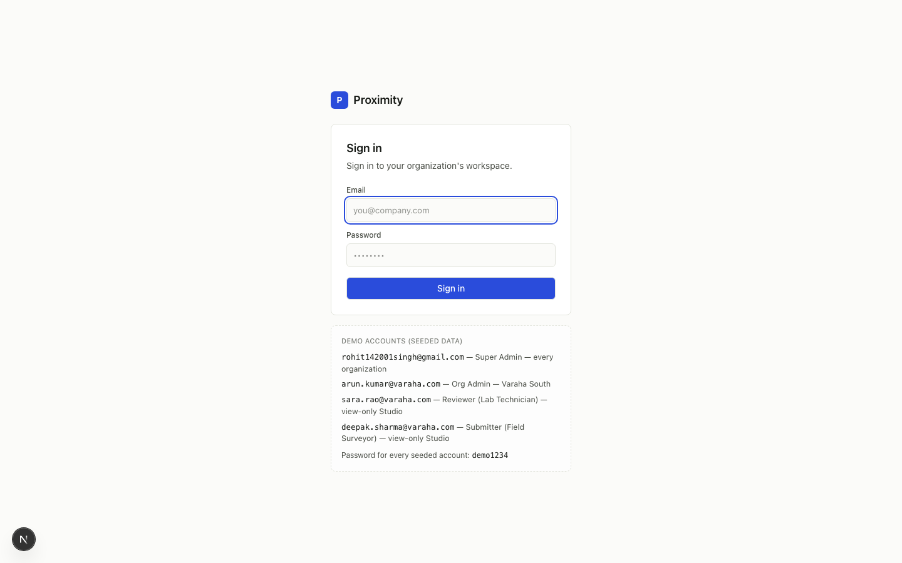 | 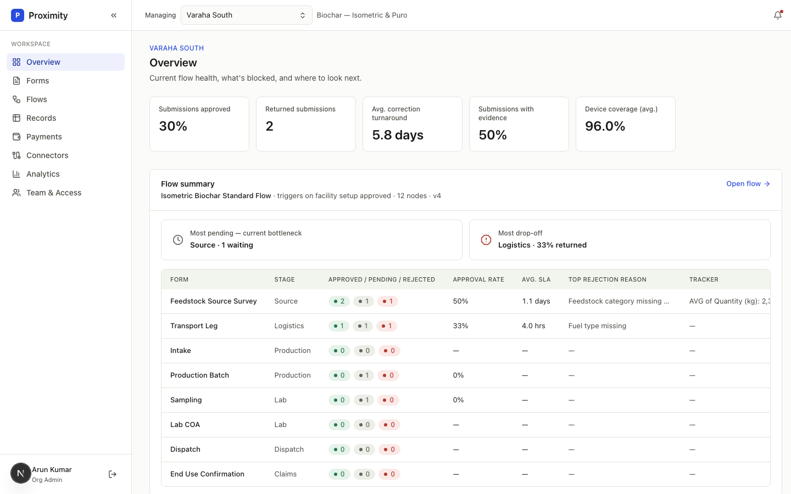 |
| **Forms & Stages** | **Form builder** |
| 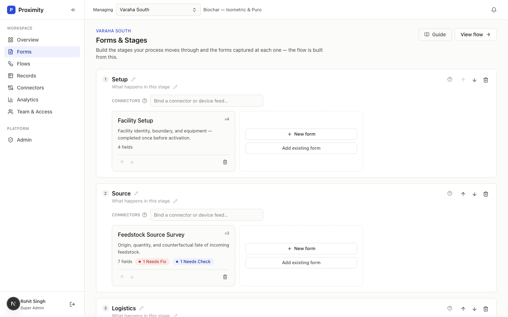 | 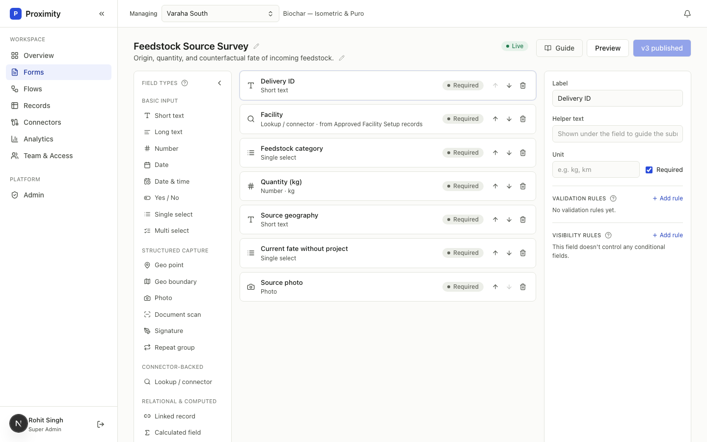 |
| **Flow Studio** | **Records — per-form grid** |
| 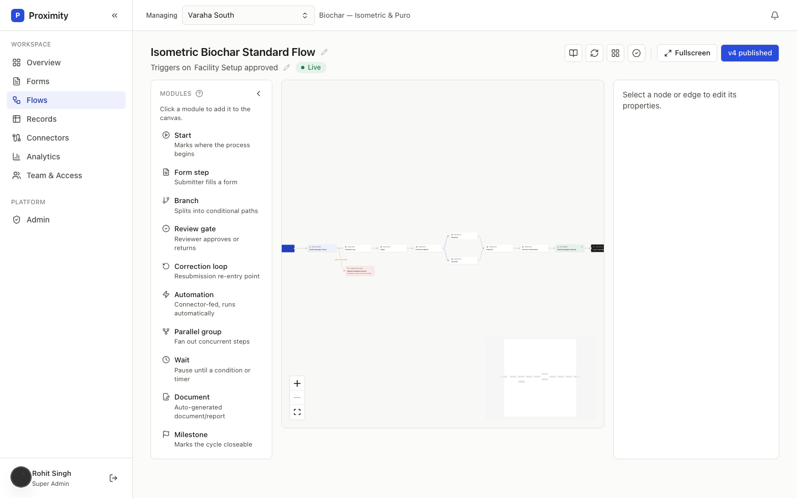 | 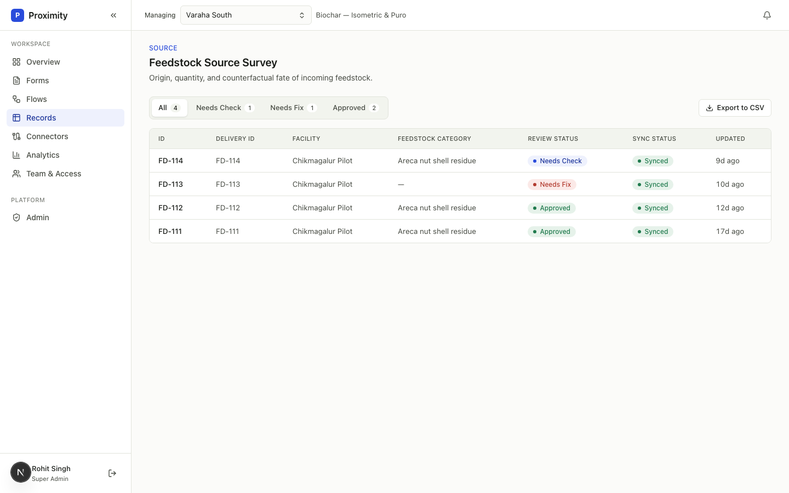 |
| **Record review** | **Connectors** |
| 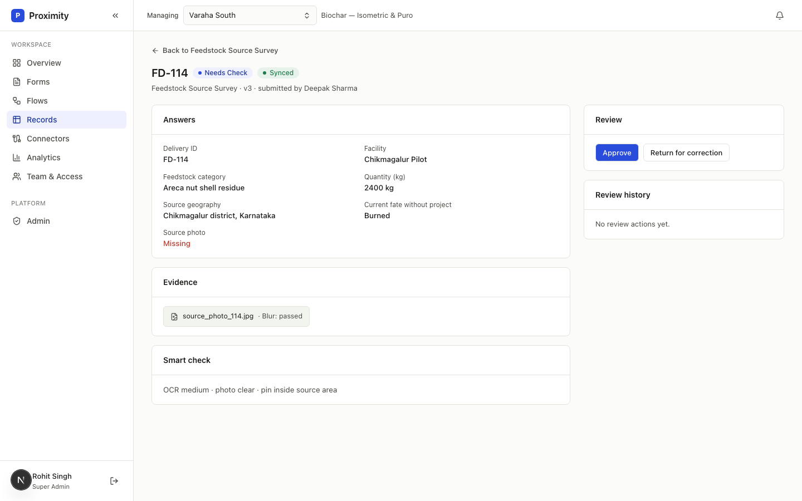 | 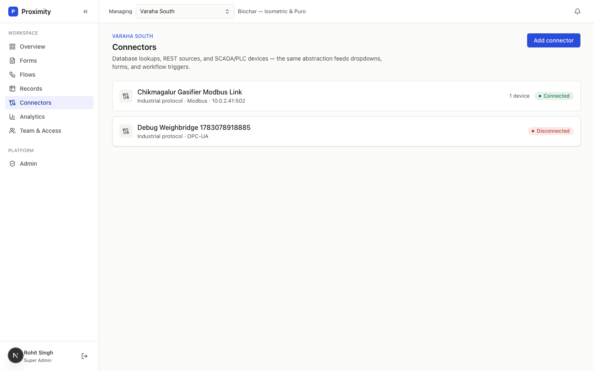 |
| **Analytics (computed live)** | **Team & Access** |
| 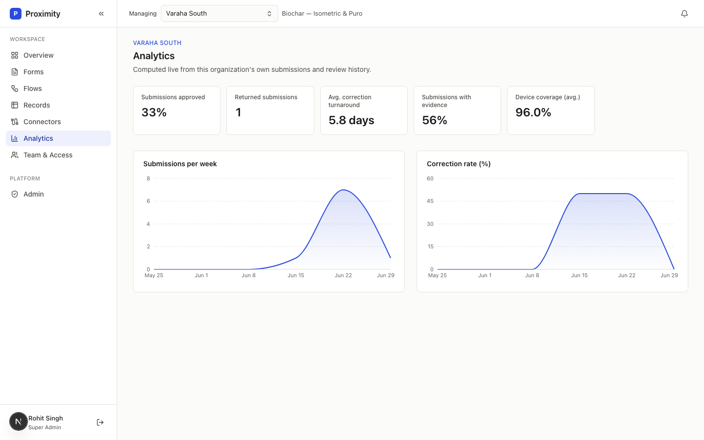 | 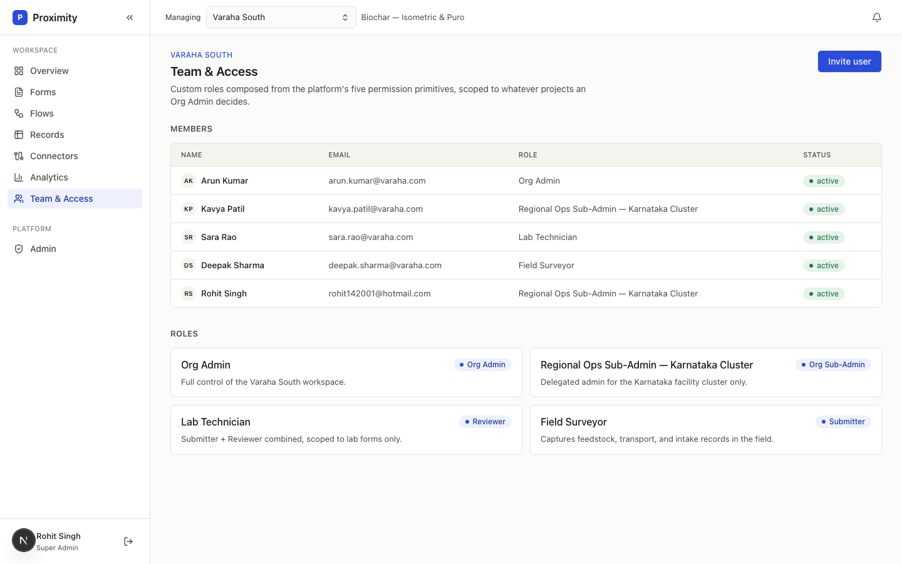 |
| **Admin — platform overview** | **Collect app (field submitter, mobile)** |
| 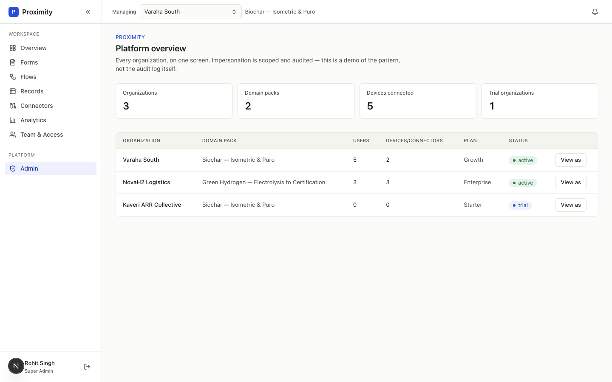 | 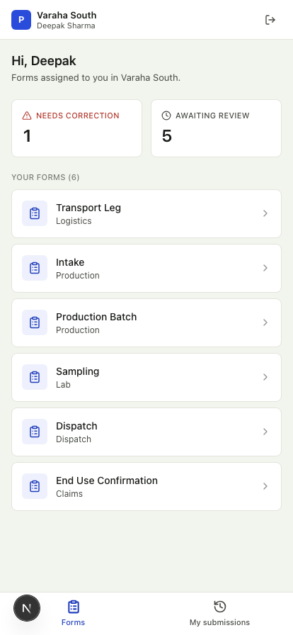 |
| **My submissions (mobile)** | **Filling a form with real device capture (mobile)** |
| 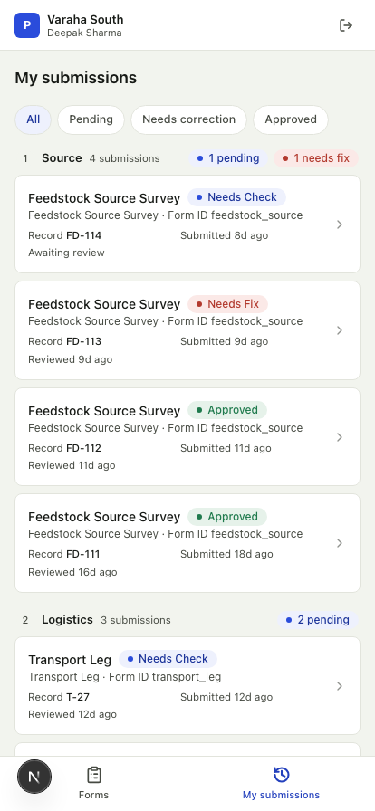 | 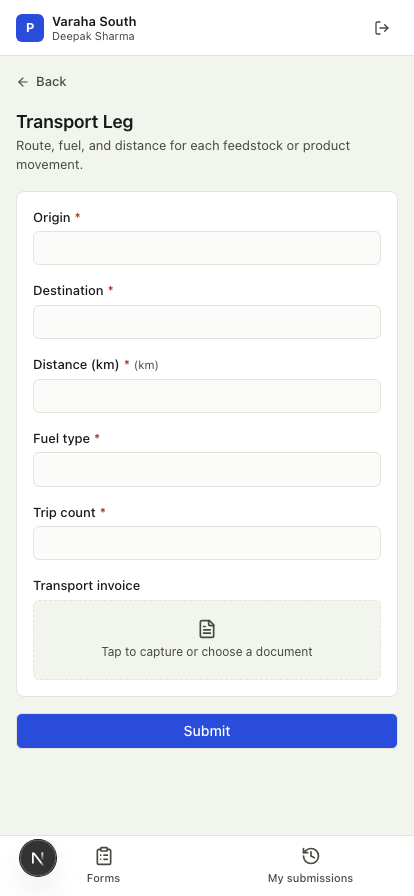 |

## What it does

A carbon program has to prove, years later, exactly what was measured, by whom, under what
definition, and that nothing was quietly changed after the fact. Proximity is built around that
constraint:

- **Studio** — build the process itself: the *Stages* it moves through, the *Forms* captured at
  each stage, and the *Flow* (a visual graph) that ties them together with review gates, branches,
  and correction loops.
- **Connectors** — register the data sources a form can pull from or push to: internal lookups,
  external databases/REST APIs, or industrial protocols (OPC-UA, Modbus, MQTT/Sparkplug B) feeding
  live telemetry from devices.
- **Collect** — a mobile-first app for the field submitter role: the forms assigned to *them*,
  filled out with real device capture (camera photos, signature pad, GPS point/boundary walking,
  document scan) and submitted for review.
- **Records** — every submission against a published form, reviewable (approve / return for
  correction), CSV-exportable, and rendered against the *exact* field definitions it was submitted
  under — even after the form has since changed.
- **Analytics** — program-level rollups (throughput, review backlog, telemetry health), computed
  live from each organization's own submission/device rows, not seed data.
- **Admin** — platform-tier oversight across every organization and domain pack.

Every read path above is tenant-isolated: a query always scopes to the caller's own organization(s),
even when multiple organizations share the same `DomainPack`.

## System architecture

```
┌─────────────────────────────────────────────────────────────────────────┐
│  Browser                                                                 │
│  Next.js App Router (React 19) — Server Components fetch via Prisma,    │
│  Client Components mutate via fetch() against Route Handlers            │
└───────────────┬───────────────────────────────────────────┬─────────────┘
                │                                            │
        Server Components                              Route Handlers
        (initial page data)                         (src/app/api/**/route.ts)
                │                                            │
                ▼                                            ▼
        src/lib/queries.ts  ───────────────────────►  src/lib/authz.ts
        (read-side Prisma)                             (session + RBAC check
                │                                        on every mutation)
                │                                            │
                └────────────────────┬───────────────────────┘
                                     ▼
                            src/lib/db.ts (Prisma client)
                                     │
                                     ▼
                         PostgreSQL (Neon, serverless)
```

- **Auth**: Auth.js v5 (Credentials provider), bcrypt-hashed passwords, JWT session. `middleware.ts`
  redirects unauthenticated requests to `/login`; `src/app/(app)/layout.tsx` resolves the session
  server-side and hydrates the client `SessionProvider`/`StudioProvider`.
- **Client state**: `src/lib/studio.tsx` holds Stages/Forms/Flows in React Context, seeded from the
  server on load. Edits apply optimistically and flush to the database via a 600ms-debounced
  `PATCH`, so typing feels instant but every keystroke doesn't fire a request.
- **Authorization is enforced twice, on purpose**: client components hide edit affordances a role
  shouldn't see (UX), and every mutating Route Handler independently re-checks via
  `src/lib/authz.ts` (security) — hiding a button never stops a direct API call.
- **Persistence**: JSONB is used deliberately (not as a shortcut) for structures that are always
  read/written as one unit and never queried field-by-field in SQL — form field definitions, flow
  node/edge graphs, submission answers. Everything that's ever filtered, joined, or counted in SQL
  (ids, statuses, foreign keys, sort order) is a real column.
- **Multi-tenant isolation**: a `DomainPack` (e.g. biochar) can be shared by several `Organization`s.
  Every read path that touches submissions, forms, flows, or stages threads the caller's own
  `organizationId` through the query (`src/lib/queries.ts`) rather than scoping by domain pack alone
  — one org can never read, export, or enumerate another org's records or process designs.
- **File uploads**: photo, signature, document-scan, and geo-boundary evidence upload directly from
  the browser to Vercel Blob storage via short-lived, auth-gated client tokens
  (`src/app/api/uploads/route.ts`) — file bytes never pass through the Next.js server, avoiding
  serverless body-size limits.
- **Race-safe record linking**: when a form field links to another org's already-submitted record
  and marks it exclusive (e.g. "this transport leg can only be claimed by one dispatch"), the claim
  is re-checked inside a `Serializable`-isolation Postgres transaction at submit time, not just when
  listing candidates — two submitters can't both claim the same upstream record.

## Domain model

```
DomainPack ("Biochar — Isometric & Puro", "Green Hydrogen — Electrolysis to Certification")
   │
   ├── Organization (a tenant running that domain's process — e.g. "Varaha South")
   │      ├── Role (tiered permission sets, some org-wide, some scoped to a project cluster)
   │      ├── OrgMembership (a User ⇄ Role binding, per org)
   │      └── Connector (a registered data source, org-scoped) ── Device ── TelemetryStream
   │
   ├── Stage (an ordered step in the process — "Feedstock Intake", "Pyrolysis Run", ...)
   │      └── owns an ordered list of FormTemplate ids and Connector ids
   │
   ├── FormTemplate (a reusable form definition — "Facility Setup", "Sample Intake COA")
   │      └── FormTemplateVersion (append-only history: "draft" while being edited,
   │           "published" and immutable forever once published — never mutated again)
   │
   ├── FlowTemplate (the visual graph tying Stages/Forms/reviews/automation together)
   │      └── FlowNodeDefinition[] / FlowEdgeDefinition[] — kept in sync with Stages by
   │           the sync engine (src/lib/flow-sync.ts), but hand-editable beyond that backbone
   │
   └── Submission (a real record — pinned to the FormTemplateVersion it was submitted under,
          so answers always render against the fields that existed at submission time,
          regardless of how many times the form has been republished since)
```

**Why versions matter**: publishing a form doesn't overwrite anything. The current draft flips to
`published` and becomes permanent history; the next edit opens a brand-new draft row. A submission
from v1 keeps rendering against v1's exact fields even after the form is on v5 — Records shows a
banner when a submission's pinned version is stale relative to the form's current version, and
`Notification` rows are fanned out to every past (non-test) submitter plus the publisher whenever a
form changes.

## User personas & permissions

Permission is a **tier** (`RoleTier`), not a single global toggle — a user's tier can differ per
organization membership, and platform tier is cross-org.

| Tier | Example role (seeded) | Can edit Studio? | Can delete a Stage? | Notes |
|---|---|:---:|:---:|---|
| `platform` | Super Admin | ✅ | ✅ | Cross-org, not tied to any one `OrgMembership`. |
| `org_admin` | Org Admin | ✅ | ✅ | Full control of one organization. |
| `org_sub_admin` | Regional Ops Sub-Admin | ✅ | ❌ | Delegated admin scoped to a project cluster; can build but not destroy. |
| `designer` | — | ✅ | ❌ | Studio-editing only, no admin actions. |
| `reviewer` | Lab Technician, Plant QA Engineer | ❌ (view-only) | ❌ | Approves/returns submissions. |
| `submitter` | Field Surveyor | ❌ (view-only) | ❌ | Fills out forms in the field. |
| `viewer` | — | ❌ | ❌ | Read-only across the board. |

Stage deletion is deliberately **stricter** than general Studio editing (`canDeleteStage` vs.
`canEditStudio` in `src/lib/permissions.ts`) — irreversible actions are gated to admin tiers only,
confirmed via a modal, enforced server-side in `requireStageDeleteAccess`.

Every persona above is real seed data (`src/data/identity.ts`) and logs in with their real email +
the shared demo password — see [Local development](#local-development).

## Features

### Studio
- **Stage board** — ordered stages, each owning a set of forms and connectors; reorder, rename
  inline (pencil-icon editing, not "everything looks editable"), delete (admin-only, confirmed).
- **Form builder** — drag-in field types (text, number, date, geo-point/boundary, photo, document
  scan, signature, lookup, linked record, calculated field, repeat group), validation rules,
  conditional visibility rules, lookup sources bound to Connectors, link filters between forms.
  - **Preview** — live render of the form as an end user would see it, with a **Desktop/Mobile**
    viewport toggle, and a **Submit test response** action that creates a real, isolated test
    `Submission` (never appears in Records or production counts) so a form can be validated before
    it's published.
- **Flow Studio** — a `@xyflow/react` canvas for the process graph: form steps, branches, review
  gates, correction loops, automations, parallel groups, waits, documents, explicit `start` and
  `milestone` (terminal) nodes. Bigger nodes and connection handles, a collapsible module palette,
  **contextual "suggested next step" buttons** in the node inspector (e.g. a review gate suggests
  a correction loop, a document, or a milestone), a **fullscreen mode** for building large graphs,
  auto-arrange (layered topological layout), and structural validation (dangling edges, unmarked
  cycles, unreachable nodes, missing start/milestone nodes, branches with fewer than two paths).
  "Sync from stages" reconciles the flow's backbone with the current Stage list without discarding
  hand-built detours like review gates.
- **Knowledge base** — inline contextual help (`InfoHint`/`KnowledgeDrawer`) explaining Studio
  concepts without leaving the builder.

### Connectors
Register internal lookups, external database/REST sources, or industrial-protocol devices
(OPC-UA / Modbus / MQTT-Sparkplug B) that forms can bind to for live dropdowns or telemetry-fed
automation. Each connector rolls up its bound `Device`s and their `TelemetryStream`s.

### Collect (field submitter app)
A separate, mobile-first surface (`/collect`) for the `submitter` role — not the Studio chrome, just
the forms assigned to that person and their own submission history:
- **Your forms** — every published form reachable from the submitter's org, with live "needs
  correction" / "awaiting review" counts.
- **Real device capture** — photo and document-scan fields open the camera/file picker and upload
  straight to blob storage; signature fields are a real drawable pad; geo-point/geo-boundary fields
  read the browser's Geolocation API (point capture or walk-and-record a boundary), not typed
  coordinates.
- **My submissions** — grouped by flow stage, filterable by status (pending / needs correction /
  approved), with a sticky header for one-handed scrolling in the field.
- **Correction loop** — a returned submission reopens in the same capture UI with the reviewer's
  notes, and resubmits as a new version rather than overwriting history.
- **Cross-form record linking** — a field can require picking an existing upstream record (e.g. a
  transport leg must reference an approved feedstock delivery); exclusive links can only be claimed
  once, enforced race-safely at submit time (see [System architecture](#system-architecture)).

### Records
Every submission, reviewable with an approve / return-for-correction workflow, review history, and
evidence attachments — rendered against the exact form-field definitions it was submitted under.
Each form's record grid can be exported to CSV, scoped to the caller's own organization.

### Notifications
A bell in the top bar with an unread-count badge. Publishing a form fans out a notification to every
past real submitter ("this form changed, your data is safe under its original version") and a
confirmation to the publisher.

### Team & Access
Real **Invite user** flow (creates the `User` + a pending `OrgMembership` against a chosen role) and
an org ("partner") switcher for users who belong to more than one organization, gated the same way
as everything else — an Org Admin manages their own org's members and custom roles; a platform admin
can move between every organization.

### Analytics & Admin
Program-level throughput/backlog/telemetry dashboards computed live from each organization's real
`Submission`/`Device` rows (approval rate, correction turnaround, evidence completeness, device
coverage, weekly submission/correction trend) — an org with no activity yet gets an honest empty
state, not fabricated numbers. Admin gives platform-tier users the same view across every
organization and domain pack.

## Usage walkthrough

**Building a process (Org Admin / Designer):**
1. Forms & Stages → **New stage** for each step of the real-world process.
2. Inside a stage, **New form** (or add an existing one) and build its fields in the Form Builder.
3. Use **Preview** to sanity-check the form (including on a simulated mobile viewport) and submit a
   few test responses before publishing.
4. **Publish** the form — this is the point its fields become immutable history.
5. Flows → open the domain's flow → **Sync from stages** to lay the Stage/Form backbone into the
   graph automatically, then hand-add review gates, branches, or correction loops using the
   palette or the inspector's "Suggested next steps." **Validate graph**, then **Publish**.

**Running the process (Submitter / Reviewer):**
1. A submitter opens the **Collect** app on their phone, picks one of their assigned forms, fills
   it out (capturing real photos, signatures, and GPS as needed), and submits.
2. A reviewer opens the submission in Records (or the submitter sees it in "My submissions"),
   approves it or returns it for correction with a reason and guidance — a returned submission
   reopens in Collect for the same submitter to fix and resubmit.
3. If the underlying form is later republished, the reviewer and the original submitter are both
   notified, and the original submission keeps rendering against the version it was actually
   collected under.

**Administering connectors:** Connectors → **Add connector** → name it, pick its type (and protocol,
if industrial), optionally set an endpoint → bind it to a stage or a form's lookup source.

## Tech stack

| Layer | Choice |
|---|---|
| Framework | Next.js 15 (App Router), React 19, TypeScript (strict) |
| Styling | Tailwind CSS v4, design tokens in `src/app/globals.css` |
| Flow canvas | `@xyflow/react` |
| Charts | Recharts |
| Database | PostgreSQL (Neon), Prisma ORM v6 |
| Auth | Auth.js v5 (Credentials, JWT sessions), bcryptjs |
| File storage | Vercel Blob (client-direct upload for photo/signature/document evidence) |
| Deployment targets | Vercel, or Docker → Google Cloud Run + Cloud SQL |

## Project structure

```
src/
  app/
    (app)/            authenticated route group — Studio, Records, Connectors, Analytics, Admin
      layout.tsx       resolves the session + hydrates SessionProvider/StudioProvider server-side
    collect/           mobile-first field-submitter app — assigned forms, fill/submit, my submissions
    api/               Route Handlers — every mutation re-checks authz independently of the client
    login/             Auth.js Credentials sign-in page
  components/
    layout/            AppShell, Sidebar, Topbar, NotificationBell
    studio/            Stage board, Form builder, Flow canvas + inspector + node catalog
    records/           Submission detail/review UI, CSV export
    connectors/         Connector creation
    collect/           Collect shell + form client + capture/ (photo, signature, geo, doc-scan)
    ui/                Shared primitives (Button, Modal, StatusChip, EditableText, ...)
  lib/
    db.ts              Prisma client singleton
    auth.ts            Auth.js config
    authz.ts           Server-side RBAC checks, one per mutation shape
    permissions.ts      Pure tier-membership predicates (canEditStudio, canDeleteStage)
    studio.tsx         Client Context: optimistic edits + debounced persistence
    queries.ts / mappers.ts   Read-side Prisma queries and Prisma-row → TS-type mappers
    flow-sync.ts       Reconciles a Flow's backbone with its Stage list
    graph-utils.ts     Layered auto-layout + structural flow validation
    notifications.ts   Fans out Notification rows on form publish
  data/                Hand-authored seed/mock content — the single source of truth the
                       seed script inserts into Postgres from (never hand-transcribed twice)
  types/               One file per domain concept, mirrored field-for-field by prisma/schema.prisma
prisma/
  schema.prisma        Full data model
  seed.ts              Idempotent upsert of everything in src/data/** into Postgres
```

## Local development

```bash
cp .env.example .env        # set DATABASE_URL (any Postgres) and AUTH_SECRET
npm install                 # postinstall runs `prisma generate`
npm run db:migrate           # applies prisma/migrations
npm run db:seed              # inserts every seeded org/user/stage/form/flow/submission
npm run dev
```

Add `BLOB_READ_WRITE_TOKEN` (from your Vercel project's Storage tab) if you want to actually capture
photos/signatures/documents in the Collect app — everything else runs without it.

Every seeded user signs in with their real email and the shared demo password `demo1234` (override
with `SEED_DEMO_PASSWORD`). The login page lists a few to try — logging in as different personas is
the fastest way to see the RBAC view/edit boundaries for real. `npm run db:studio` opens Prisma
Studio to inspect the database directly.

## Deployment

See [`DEPLOY.md`](./DEPLOY.md) for full steps. Short version: both paths need `DATABASE_URL` and a
per-environment `AUTH_SECRET`.

- **Vercel** — import the repo, add the two env vars, set the build command to
  `prisma migrate deploy && next build`, deploy, seed once from your machine.
- **Google Cloud (Cloud Run + Cloud SQL)** — this repo ships a multi-stage `Dockerfile`
  (`output: "standalone"`, Prisma engine binaries copied explicitly). Attach Cloud SQL via its Unix
  socket, run the migration once as a Cloud Run Job, then deploy.

## Prototype boundaries & roadmap

Flagged explicitly rather than silently glossed over — this list reflects the actual code today,
not a stale snapshot:

- **No server-side validation that submitted answers match the form's actual field set.** The
  Collect app enforces required fields client-side, but the collect API route accepts whatever
  answers array it's given rather than cross-checking it against the published form's fields.
- **`single_select` / `multi_select` fields render as free-text inputs**, in both Collect and the
  Form Builder's Preview — the field *type* and its options are modeled and stored, but there's no
  real dropdown/checkbox UI yet, which defeats controlled-vocabulary data quality for those fields.
- **`repeat_group` has no Collect-side renderer.** It's offered as a field type in the Form Builder,
  but a submitter has no way to fill in a repeating group of sub-fields yet.
- **Document-scan uploads are inconsistent about PDFs.** The Collect file picker accepts
  `application/pdf`, but the upload route's `allowedContentTypes` only lists image MIME types — a
  submitter picking a real PDF will see the file dialog accept it and the upload then fail.
- **Most API routes don't wrap their Prisma calls in try/catch** — a database hiccup surfaces as an
  opaque 500 rather than a structured error response.
- **The seed script's shared demo password (`demo1234`)** is fine for this seeded dataset but would
  be a real weakness if `prisma/seed.ts` were ever run against a production database as-is.

None of the above affect the things that matter most for field data integrity — tenant isolation,
form-version pinning, review/correction history, and exclusive-link race safety are all real and
verified (see [System architecture](#system-architecture)).
